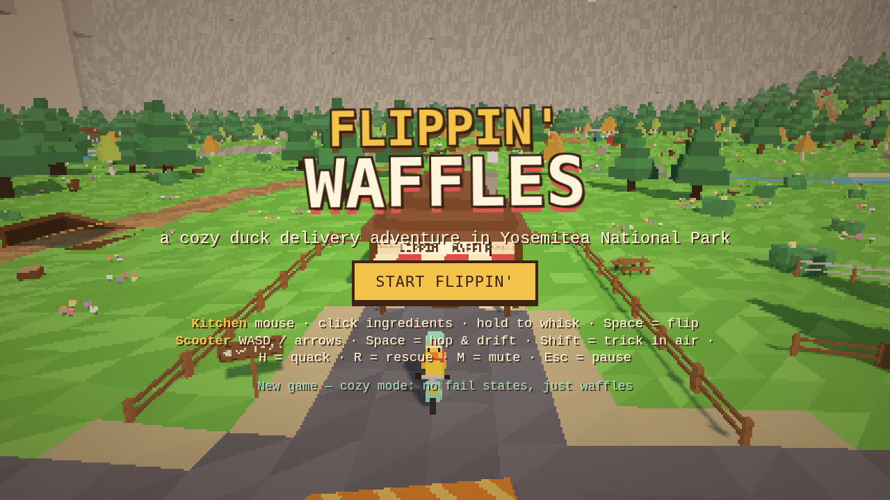

# Flippin' Waffles 🧇🦆

A cozy, cute **3D pixel-art** browser game. You are a duck who runs a waffle delivery
business in **Yosemitea National Park**: mix batter and flip waffles to match each order,
box them up, then hop on your scooter and race through the valley Mario-Kart style —
drift-boosting, hopping fences, grinding rails, pulling tricks off ramps, taking dirt
shortcuts through the sequoia grove, and quacking at the bears who want your waffles.

No build step, no dependencies to install: open `index.html` in a browser, or serve
the folder (`npm start`). Everything (Three.js included) is in the repo.



## How to play

**Loop:** cook the order → deliver it → ride home → next order. Three orders a day,
progress is saved in your browser. Cozy mode: there are no fail states, only smaller tips.

### Kitchen (mouse)
| Action | How |
|---|---|
| Add flour / sugar / egg / milk | click the ingredient (match the counts on the ticket) |
| Whisk | hold the mouse on the bowl (or hold Space) — release in the green zone |
| Pour | click the waffle iron |
| Flip the iron | click it / Space when the meter is in the **golden zone** |
| Open the iron | click it / Space in the golden zone (early = pale, late = burnt) |
| Toppings | click the little bowls to add/remove; match the ticket |
| Box it | click the delivery box |

### Scooter (keyboard)
| Action | Keys |
|---|---|
| Drive / brake / reverse | W / S or ↑ / ↓ |
| Steer | A / D or ← / → |
| Hop | Space (hop over fences!) |
| Drift | hold Space while steering as you land → release for a mini / super / ULTRA turbo |
| Trick in the air | Shift (or E) — steer/lean for spins and flips; land it for a boost |
| Grind a rail | hop onto a rail or log — Space to hop off |
| Quack (scares bears) | H |
| Rescue when stuck | R |
| Pause / mute | Esc / M |

Dirt paths are shortcuts (slower surface, but shorter, and full of ramps and fences).
Orange boost pads on the road give a burst. Bears roam the meadows and will chase you
when you carry waffles — honk to scare them off, or they'll steal one. Tricks and rail
grinds earn **style** points that turn into tips.

## Tech
- Vanilla JavaScript + [Three.js](https://threejs.org) r158 (vendored in `vendor/`).
- 3D pixel-art look: the scene renders to a low-res canvas (about 230 px tall) that is
  upscaled with nearest-neighbour filtering, with cel/toon shading and voxel-built models.
- Procedural world: a heightfield valley with a river, granite rims, Half Dome and El
  Capitan silhouettes, waterfalls, roads rasterised into the terrain, bridges, fences,
  rails, ramps, campsites, ~1500 instanced trees, and roaming bears.
- Procedural audio (WebAudio): engine, quacks, sizzle, drift sparks, and two chiptune loops.

```
index.html        page + HUD markup
src/style.css     HUD styling
src/util.js       math, RNG, noise, input
src/pixel.js      low-res renderer, toon materials, particles
src/voxel.js      voxel model library (duck, scooter, bears, trees, buildings, waffles…)
src/world.js      terrain / roads / props / colliders
src/kart.js       scooter physics, drift, tricks, rails, camera
src/bears.js      bear AI
src/kitchen.js    cooking minigame
src/orders.js     recipes, customers, scoring
src/hud.js        DOM overlay
src/audio.js      procedural sound & music
src/main.js       game states & loop
tools/build.js    bundles everything into dist/flippin-waffles.html (single file)
```

`node tools/build.js` produces a single self-contained HTML file you can send to anyone.
