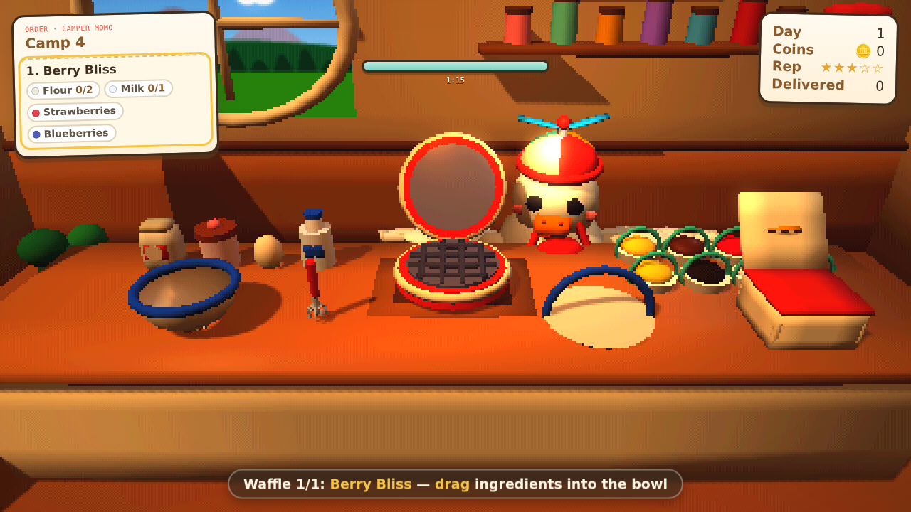
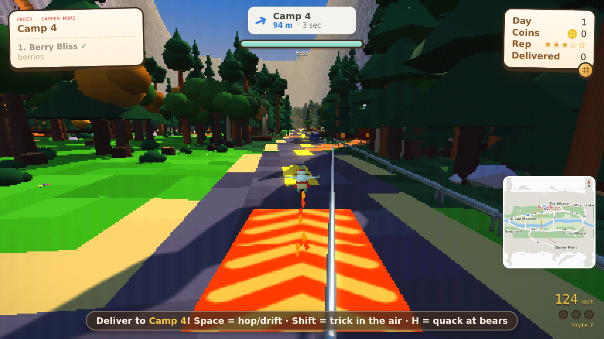

# Flippin' Waffles 🧇

A cozy, cute **3D browser game**: you are a fat, chunky **wombat** in an apron and a
helicopter beanie who runs a waffle delivery business in **Yosemite Valley**.

The valley is laid out to follow the real place — a long east-west trough with the
Merced meandering down the middle, Northside and Southside Drive along the floor,
granite walls north and south, and El Capitan, Half Dome, Sentinel Rock, Yosemite
Falls, Bridalveil, Mirror Lake, Camp 4, Curry Village and Glacier Point roughly where
a map puts them. Traffic drives the loop, steel guardrails line the drops, and the
phone clipped to your handlebars navigates you there like a maps app, route line and all.

Cook each order by hand, all by tapping: open the fridge, tap ingredients into the bowl,
tap to stir until the lumps are gone, tap the iron to pour, and lift the waffle out when
it *looks* golden — there is no timing bar anywhere, you judge it by the colour, the
steam and the smell. Spills and splatter stay on the counter as real mess; grab the
sponge and wipe them whenever you like (a spotless kitchen tips better).

Then load the box onto your scooter and race the valley Mario-Kart style: drift-boosting,
hopping fences, grinding guardrails, launching off bouncy mushrooms, riding a banked
timber flume, cutting through a hollow sequoia, dodging traffic, and honking at the bears
who want your waffles. On a phone or tablet you get a **steering wheel and pedals**.

The look is **realistic**, not pixel art: full-resolution rendering with filmic tone
mapping, image-based lighting, soft shadows, bloom, a warm grade and a touch of film
grain. Asphalt, concrete, timber and stone are all real textures. **There is almost no
floating UI** — the order ticket lives on a tablet propped on the kitchen counter and
the nav lives on the phone on your scooter, so you read the game inside the world.

No build step and nothing to install: open `index.html`, or serve the folder
(`npm start`). Three.js ships in the repo.


| The kitchen | On the road |
|---|---|
|  |  |

## How to play

**The loop:** cook the order → deliver it → ride home → next order. Three orders a day.
Progress saves in your browser. Cozy mode: there are no fail states, only smaller tips.

### Kitchen — drag and drop
| Action | How |
|---|---|
| Get ingredients | **tap the fridge** to open it, then **tap an item** for one scoop. Over-scoop and it slops over the side |
| Stir | **tap the bowl** — every tap beats out one lump. When the last lump goes it sparkles. Keep beating and batter goes everywhere |
| Pour | **tap the bowl** once it is smooth (or tap the iron) |
| Lift it out | **tap the iron** when it looks right. No meter: watch the colour through the steam, and the golden wisp that means it is ready |
| Toppings | **tap a topping**, then **tap the waffle** to place it there. Miss and it hits the floor |
| Box it | **tap the delivery box** |
| Clean up | **tap the sponge** by the sink, then **tap any mess**. Tap anything else to put it down |

### Scooter
On touch devices an on-screen **steering wheel**, **GO/BRAKE pedals** and hop/trick/honk
buttons appear automatically.

| Action | Keys |
|---|---|
| Drive / brake / reverse | W / S or ↑ / ↓ |
| Steer | A / D or ← / → |
| Hop | Space — clears fences |
| Drift | hold Space while steering as you land, release for a mini / super / **ULTRA** turbo |
| Trick in the air | Shift (or E) — lean for spins and flips; land it for a boost |
| Grind a rail | hop onto a rail, a bridge railing or a fallen log; Space to hop off |
| Honk (scares bears) | H |
| Rescue when stuck | R |
| Pause / mute | Esc / M |

### Out in the valley
- **Traffic** on Northside and Southside Drive — sedans, an RV, a shuttle bus, a ranger
  pickup — plus full parking lots at the Village, Curry and Glacier Point. Hitting one hurts.
- **Steel guardrails** along the river drops and the mountain road. They are also the best
  grind rails in the park.
- **Boost pads** on the drives, **bouncy mushrooms** that fling you skyward.
- **The flume** — a long banked timber chute down the talus below Glacier Point. Gravity
  pulls you to the middle; carve the walls to keep your speed.
- **A hollow sequoia tunnel**, and dirt trails (Valley Loop, Four Mile, Mist) that are
  slower underfoot but much shorter.
- **A canyon gap** where the river crossing meets the Merced: hit the boost pad, clear
  the jump, fly the ring.
- **Air rings** for a boost, **syrup tokens** for coins, both worth style points that
  become tips at the end of a run.
- **Bears** roam the meadows with their cubs and will chase you when you carry waffles.
  Honk to scare them off, or they take one.
- **Your phone** is the map: clipped to the handlebars, it shows the turn arrow,
  distance and ETA over landcover, cased roads, the Merced, place labels, a routed blue
  line along the roads to your drop-off and a heading pip for you. In the kitchen the
  same interface is a tablet on the counter showing the order ticket.

## Tech
- Vanilla JavaScript + [Three.js](https://threejs.org) r158 (vendored in `vendor/`).
- **Realistic rendering.** Characters and props are built from spheres, capsules, tori
  and rounded boxes, merged per material family so a whole character is 1–3 draw calls.
  The scene is lit with a sun, a sky/ground hemisphere, a fill light and a procedurally
  generated IBL probe, rendered at full resolution with soft shadow maps, tone-mapped
  with ACES, then pushed through a bright-pass bloom and a composite that adds a warm
  grade, saturation, fine film grain and a vignette. No quantisation, no pixel filter.
- **Cut-out foliage.** Every tree is a trunk plus a handful of textured cards drawn from
  one procedurally generated greyscale atlas (needle spray, broadleaf cluster, grass
  tuft, plus a solid cell for trunks), so trunks and leaves share a single material and a
  forest chunk is one draw call. Ground cover, ferns and meadow flowers use the same
  atlas. Around 500k triangles and ~600 draw calls in a typical frame.
- **Textures.** Asphalt with baked lane markings and tyre polish, ground grain,
  floorboards, wallpaper, backsplash tiles, the rug, concrete and every road sign are
  drawn to canvas at load time — no image files ship with the game. Roads are textured
  ribbons laid over the terrain rather than flat vertex colours.
- **Springy animation.** A small spring solver drives squash-and-stretch, suspension
  travel, lean and every UI pop, so nothing moves on a plain linear lerp.
- **A face, not a rig.** The wombat's eyes and mouth are one alpha-cut card in front of
  the head, redrawn from a canvas per expression — neutral, happy, joy, focus, worry,
  surprise, blink and sad — driven by what is happening (drifting, boosting, airborne,
  stunned, spilling batter).
- **Tap-to-move camera.** The kitchen has framed camera stations (wide, prep, cook,
  plate); tapping an object glides the camera to its station with pointer parallax, so
  you move around the room by looking at what you want to use.
- **Procedural world.** A heightfield valley with the Merced meandering through it,
  granite walls, Half Dome, El Capitan, Cathedral Rocks, Sentinel Rock, three waterfalls,
  roads rasterised into the terrain, stone-parapet bridges, a banked chute, ramps, rails,
  campsites, and a dark North American conifer forest of ~3500 instanced trees — firs,
  ponderosas, cedars, sequoias, black oaks, snags, deadfall and ferns. Instances are
  bucketed into a 6x6 grid so the camera and the shadow pass cull most of the forest
  (about 390k triangles and 67 draw calls in a typical frame).
- **Routing.** The roads form a weighted graph; Dijkstra over it draws the blue route
  line on the map card, re-snapping as you drive.
- **Procedural audio** (WebAudio): engine, honks, sizzle, drift sparks, two chiptune loops.

```
index.html        page + touch-control markup
src/style.css     touch controls & the few remaining overlays
src/util.js       math, RNG, noise, input
src/pixel.js      renderer, lighting rig, post-process, procedural textures, particles
src/models.js     model library (wombat, scooter, bears, trees, buildings, waffles…)
src/world.js      terrain / roads / props / colliders / traversal features
src/kart.js       scooter physics, springs, drift, tricks, rails, camera
src/bears.js      bear AI
src/kitchen.js    tap-driven cooking, camera stations, mess & cleaning
src/orders.js     recipes, customers, scoring
src/hud.js        HUD data store, tooltips, minimap source
src/phone.js      the in-world phone / tablet screen (order + nav)
src/audio.js      procedural sound & music
src/main.js       game states & loop
tools/build.js    bundles everything into dist/flippin-waffles.html (single file)
```

`node tools/build.js` produces one self-contained HTML file you can send to anyone.
